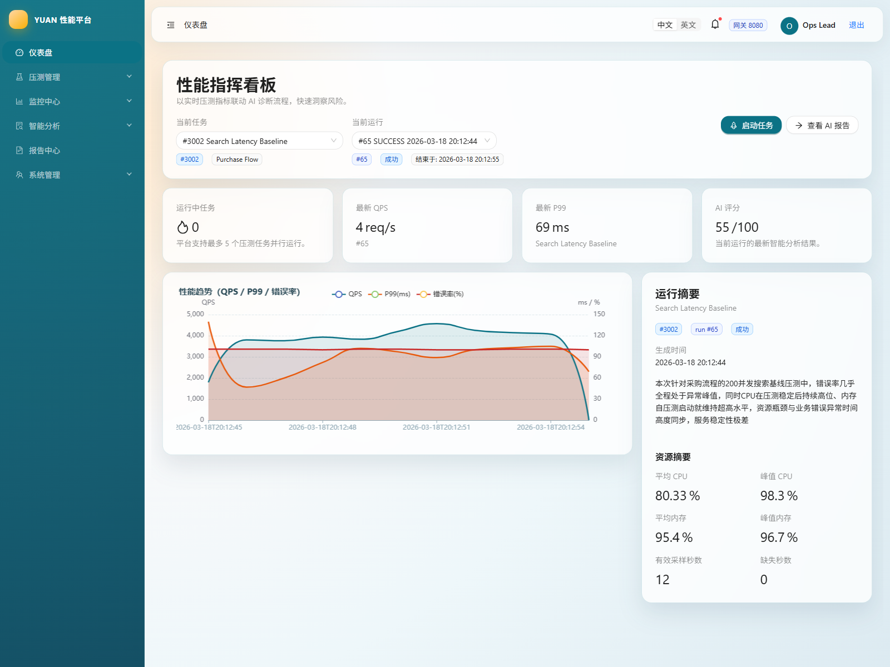
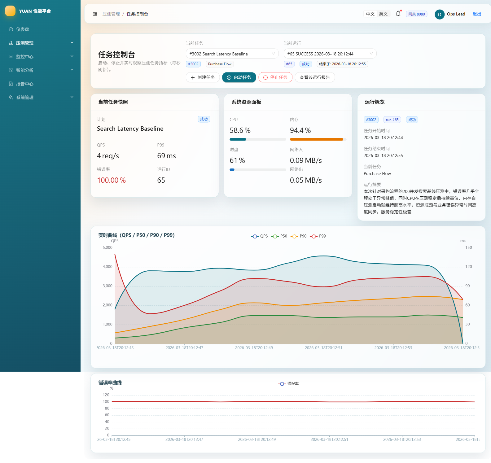
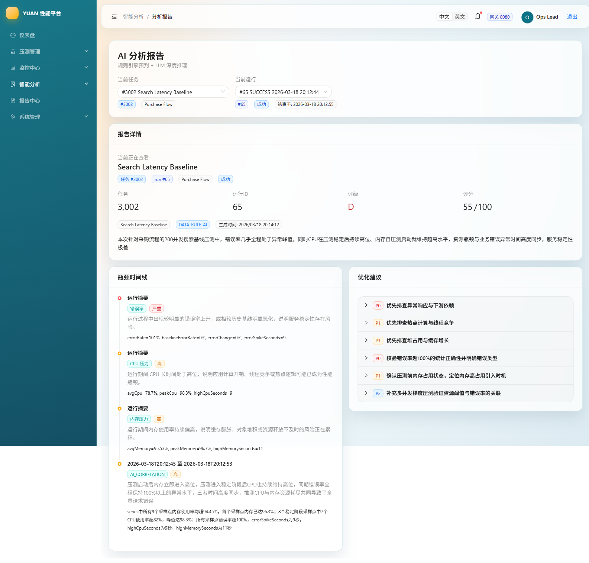
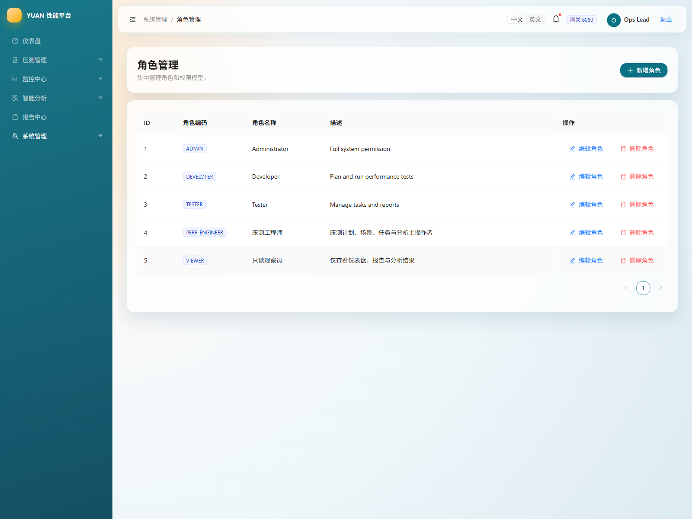
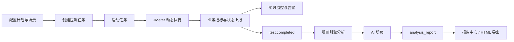

# YUAN 性能压测与智能分析平台

YUAN 是一个把 **压测执行、实时监控、规则分析、AI 增强、报告沉淀、RBAC 权限管理** 串成闭环的微服务项目。它的重点不是“把压测跑起来”，而是把一次压测从任务编排到最终结论完整落地成一个可演示、可部署、可继续演进的平台。

## 项目亮点

- 压测计划、场景、任务三层模型，支持通过 UI 组织业务压测链路。
- JMeter 动态组装执行，任务启动后自动产出 run 级运行记录。
- WebSocket + 轮询双通道实时指标展示，覆盖 QPS、P50、P90、P99、错误率。
- 系统资源按高频采样、秒桶聚合、缺失秒标记沉淀到 run 级资源视图。
- 规则引擎负责“确定性结论”，AI 负责“解释、归因和建议增强”。
- 报告中心支持 run 级预览、HTML 导出和从报告回跳到分析页面。
- 后台具备完整 RBAC：用户、角色、菜单、权限点联动生效。

## 界面预览

### 仪表盘



### 任务控制台



### AI 分析报告



### 角色与权限管理



## 核心流程



## 模块结构

### 后端

- `backend/yuan-auth`：认证、登录、刷新、用户信息、RBAC。
- `backend/yuan-gateway`：统一入口、JWT 透传、服务路由。
- `backend/yuan-test`：压测计划、场景、任务、JMeter 执行。
- `backend/yuan-monitor`：实时指标、资源采样、告警、WebSocket。
- `backend/yuan-analysis`：规则分析、AI 增强、报告生成。
- `backend/yuan-report`：报告中心接口与报告资产能力。
- `backend/yuan-api`：共享 DTO / Feign 定义。
- `backend/yuan-common`：通用返回结构、常量、工具类。

### 前端

- `yuan-web`：React + TypeScript + Ant Design 单页应用。

### 部署

- `deploy`：统一部署入口，包含 Docker Compose、SQL、Nacos 配置、Nginx、JMeter、脚本和运行态目录。

### 示例

- `examples`：可直接用于演示和录入的计划、场景、规则示例。

## 仓库结构

```text
.
├─ backend/
├─ yuan-web/
├─ deploy/
├─ examples/
├─ jmeter/
└─ img/
```

## 快速开始

### 方式一：按部署目录启动演示环境

1. 阅读 [deploy/README.md](deploy/README.md)。
2. 复制 [deploy/.env.example](deploy/.env.example) 为 `deploy/.env`，按目标机器修改密码和 JMeter 宿主机路径。
3. 准备 `deploy/server/` 下的后端 JAR。
4. 启动统一环境：

```bash
cd deploy
docker compose up -d
```

5. Nacos 启动成功后，导入配置：

```bash
sh deploy/scripts/import-nacos-config.sh --env prod --server-addr 127.0.0.1:8848 --username nacos --password nacos
```

Windows 下可用：

```powershell
pwsh -File deploy/scripts/import-nacos-config.ps1 -Env prod -ServerAddr 127.0.0.1:8848 -Username nacos -Password nacos
```

### 方式二：本地开发启动

1. 复制 [.env.example](.env.example) 的内容到本地 `.env`，按需调整。
2. 准备 JDK 21、Maven 3.9+、Node.js 20+，以及 MySQL / Redis / RabbitMQ / Nacos / JMeter。
3. 启动前端：

```bash
cd yuan-web
npm install
npm run dev
```

4. 按模块顺序启动后端服务：
   - `yuan-auth`
   - `yuan-test`
   - `yuan-monitor`
   - `yuan-analysis`
   - `yuan-report`
   - `yuan-gateway`

## 默认账号

如果你使用 `deploy/sql` 的初始化脚本：

- 平台管理员：`admin / admin123`
- Nacos 管理员：`nacos / nacos`

## 模板与示例

- 根环境变量示例：[.env.example](.env.example)
- 部署环境变量示例：[deploy/.env.example](deploy/.env.example)
- 压测计划示例：[examples/test-plan.sample.json](examples/test-plan.sample.json)
- 压测场景示例：[examples/test-scene.sample.json](examples/test-scene.sample.json)
- 规则引擎规则示例：[examples/analysis-rule.engine.sample.json](examples/analysis-rule.engine.sample.json)
- AI 规则示例：[examples/analysis-rule.ai.sample.json](examples/analysis-rule.ai.sample.json)
- 默认规则模板：[backend/yuan-analysis/src/main/resources/rules/default-rules.json](backend/yuan-analysis/src/main/resources/rules/default-rules.json)
- 默认报告模板：[backend/yuan-report/src/main/resources/templates/default-report-template.html](backend/yuan-report/src/main/resources/templates/default-report-template.html)

## 技术栈

### 后端

- Java 21
- Spring Boot 3.5.x
- Spring Cloud / Spring Cloud Alibaba
- Spring Cloud Gateway
- OpenFeign
- MyBatis-Plus
- MySQL 8
- Redis 7+
- RabbitMQ 4.x
- Nacos 3.1.x
- Spring AI
- JMeter 5.6.3

### 前端

- React
- TypeScript
- Vite
- Ant Design
- React Router
- i18next
- ECharts

## 文档索引

- [deploy/README.md](deploy/README.md)
- [deploy/sql/README.md](deploy/sql/README.md)
- [deploy/nginx/README.md](deploy/nginx/README.md)
- [deploy/jmeter/README.md](deploy/jmeter/README.md)
- [deploy/scripts/README.md](deploy/scripts/README.md)
- [deploy/server/README.md](deploy/server/README.md)
- [examples/README.md](examples/README.md)

## 说明

README 中的界面截图来自项目当前实现的真实页面，用于尽量还原 V1 演示状态。仓库里已经移除了未接入的空壳文件，并补齐了可直接参考的模板与示例文件，便于继续完善成公开展示或交付仓库。

