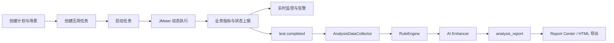

# YUAN 性能压测与智能分析平台

YUAN 是一个面向性能压测场景的微服务平台，目标不是只把压测跑起来，而是把 **压测执行、实时监控、规则分析、AI 增强、报告沉淀、权限管理** 串成一个完整闭环。

当前仓库已经达到可以作为 **V1 / 第一版** 交付和演示的状态。

## 项目定位

这个项目主要解决 3 类问题：

- **怎么组织和执行压测**：通过计划、场景、任务把压测参数和业务链路组合起来，再由 JMeter 动态生成并执行脚本。
- **怎么在运行中观察风险**：通过实时业务指标、系统资源采样、告警规则和 WebSocket 推送，快速看到压测过程中的异常。
- **怎么在运行后形成结论**：通过规则引擎 + AI 增强，把 run 级数据沉淀成分析报告和可导出的报告资产。

## 系统截图

### 仪表盘


### 任务控制台


### AI 分析报告


### 角色与权限管理


## V1 功能概览

### 1. 压测管理

- 压测计划管理：目标地址、并发、时长、加压模式
- 场景编排：按步骤组织业务请求流
- 创建任务：选择计划 + 选择场景生成可执行任务
- 任务控制台：启动、停止、查看当前运行、打开报告
- JMeter 动态脚本生成：支持 `CONSTANT / LINEAR / STAIR`

### 2. 监控中心

- 任务运行状态 WebSocket 推送
- 业务指标实时曲线：QPS / P50 / P90 / P99 / Error Rate
- 系统资源采集：CPU / Memory / Disk / Network
- 高频采样 + 秒桶聚合 + 缺失秒标记
- 告警规则管理：支持阈值规则、活跃告警和告警记录

### 3. 智能分析

- `test.completed` 事件触发分析
- 分析快照采集：运行上下文、秒级指标、baseline、资源摘要
- 规则引擎：
  - `FAILED_RUN`
  - `HIGH_LATENCY`
  - `ERROR_SPIKE`
  - `THROUGHPUT_REGRESSION`
  - `CPU_PRESSURE`
  - `MEMORY_PRESSURE`
- AI 增强层：
  - 解释层
  - 归因层
  - 建议层
  - 报告增强层
- HTML 报告渲染

### 4. 报告中心

- run 级报告列表
- 详情预览
- HTML 导出
- 从报告中心快速回跳分析页

### 5. 系统管理

- 登录 / 刷新 / 退出
- 用户管理：查看、启停、新建用户
- 角色管理：新增、编辑、删除、绑定权限、绑定菜单
- 菜单管理：菜单树读取与角色可见性控制
- 前端菜单 / 路由 / 按钮按真实权限模型生效

## 核心业务闭环



## 模块职责

### 后端服务

- `yuan-auth`
  - 认证、登录、刷新、用户信息、RBAC
- `yuan-gateway`
  - 统一入口、JWT 透传、路由转发
- `yuan-test`
  - 压测计划 / 场景 / 任务 / 运行、JMeter 执行
- `yuan-monitor`
  - 实时指标、系统资源采样、告警管理、WebSocket
- `yuan-analysis`
  - 数据采集、规则引擎、AI 增强、分析报告生成
- `yuan-report`
  - 报告中心接口、报告资产管理
- `yuan-api`
  - 各服务共享 DTO / Feign 定义
- `yuan-common`
  - 通用常量、工具类、JWT、统一返回结构

### 前端

- `yuan-web`
  - React + Ant Design 单页应用
  - 覆盖仪表盘、压测管理、监控中心、智能分析、报告中心、系统管理

### 部署资源

- `deploy/`
  - V1 首次交付所需的基础设施、SQL、Nacos、Nginx、JMeter、脚本模板

## 技术栈

### 后端

- Java 21
- Spring Boot 3.5.x
- Spring Cloud / Spring Cloud Alibaba
- Spring Cloud Gateway
- OpenFeign
- MyBatis-Plus
- MySQL 8
- Redis 7
- RabbitMQ 3
- Nacos 2
- Spring AI（当前部署模板默认 `fallback`）
- JMeter 5.6.3

### 前端

- React
- TypeScript
- Vite
- Ant Design
- React Router
- i18next
- ECharts

## 仓库结构

```text
.
├─ backend/
│  ├─ yuan-auth/
│  ├─ yuan-gateway/
│  ├─ yuan-test/
│  ├─ yuan-monitor/
│  ├─ yuan-analysis/
│  ├─ yuan-report/
│  ├─ yuan-api/
│  └─ yuan-common/
├─ yuan-web/
├─ jmeter/
├─ deploy/
└─ img/
```

## 快速开始

### 运行环境

建议准备：

- JDK 21
- Maven 3.9+
- Node.js 20+
- MySQL 8
- Redis 7
- RabbitMQ 3
- Nacos 2
- JMeter 5.6+

### 方式一：使用 deploy 目录还原 V1 环境

最推荐按 `deploy/` 目录的方式启动，它更接近项目第一版交付状态。

1. 阅读 [deploy/README.md](deploy/README.md)
2. 启动基础设施：

```powershell
docker compose -f deploy/docker/docker-compose.infra.yml up -d
```

3. 如需导入 Nacos 配置：

```powershell
pwsh -File deploy/scripts/import-nacos-config.ps1 -Env dev -ServerAddr 127.0.0.1:8848
```

4. 按顺序启动后端服务：
   - `yuan-auth`
   - `yuan-test`
   - `yuan-monitor`
   - `yuan-analysis`
   - `yuan-report`
   - `yuan-gateway`
5. 启动前端：

```powershell
cd yuan-web
npm install
npm run dev
```

### 方式二：本地开发启动

如果你已经自己准备好了 MySQL / Redis / RabbitMQ / Nacos / JMeter，也可以直接本地启动。

#### 1. 校验后端

```powershell
mvn -pl backend -am validate -DskipTests
```

#### 2. 启动前端

```powershell
cd yuan-web
npm install
npm run dev
```

#### 3. 默认访问地址

- 前端：`http://127.0.0.1:5173`
- 网关：`http://127.0.0.1:8080`

## 默认账号

如果你使用 `deploy/sql` 的初始化脚本，系统会自动创建默认管理员账号：

- 用户名：`admin`
- 密码：`admin123`

这个账号会自动拥有：

- 全部菜单
- 全部权限
- 用户 / 角色 / 菜单管理能力

## AI 说明

当前项目对 AI 的定位不是替代规则引擎，而是作为：

- 解释层
- 归因层
- 建议层
- 报告增强层

默认部署模板为了保证首次启动成功，`yuan-analysis` 会把 `provider` 配成 `fallback`。这样即使没有外部模型 Key，分析主链也能完整运行。

如果你要接入真实模型，再把配置切换到 `seed2.0-lite`，并补上对应的模型 Key / base-url 即可。

## V1 当前状态

当前仓库已经可以视为 `V1.0`：

- 主业务闭环已打通
- 模块边界已明确
- 前后端已形成完整平台形态
- 权限模型已落地
- 部署目录已补齐为首发交付形态

更适合继续做的工作，已经不是再盲目堆新模块，而是：

- 稳定性验证
- 端到端验收
- 自动化测试
- V1.1 体验增强

## 部署与初始化说明

更完整的部署细节请看：

- [deploy/README.md](deploy/README.md)
- [deploy/sql/README.md](deploy/sql/README.md)
- [deploy/docker/README.md](deploy/docker/README.md)
- [deploy/jmeter/README.md](deploy/jmeter/README.md)
- [deploy/nginx/README.md](deploy/nginx/README.md)

## 说明

README 中使用的页面截图由本地运行中的系统通过 Playwright 采集，保存在 `img/` 目录下，用来尽量还原 V1 真实界面状态。
